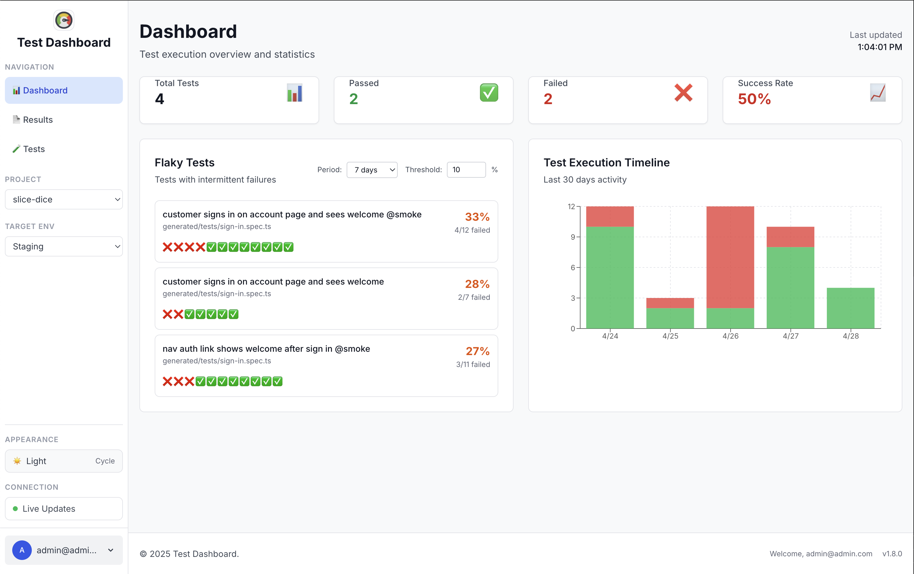
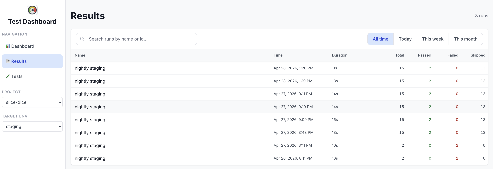
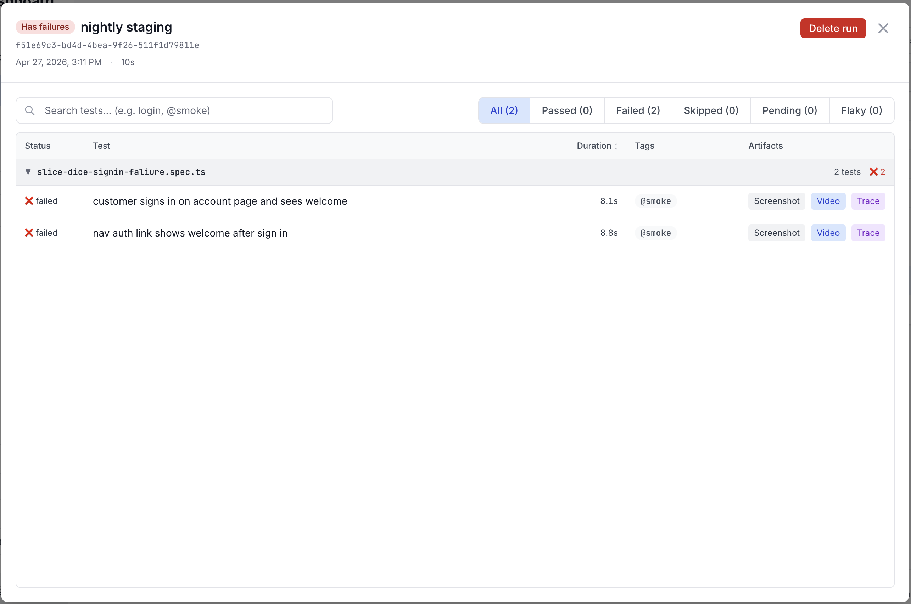

# Test Dashboard

Forked and customized from `shvydak/yshvydak-test-dashboard`.



Key changes in this fork:

- Add **Results tabs** to browse all runs, with drill-down into a single run’s tests
- Improve filtering (search by **test name** and `@tags`)
- Add **project** configuration + filtering
- Add **target environment** configuration + filtering
- Enchance test artifacts with video and trace viewer
- Admin project and env mangagement
- Remove rerun feature which is not that useful
- Fixing bugs

> 🎭 **Modern, full-stack dashboard for Playwright tests **

A comprehensive testing dashboard that transforms your Playwright test experience with real-time monitoring, and beautiful reporting. Built for teams who value efficiency and visibility in their testing workflows.

> **📦 Reporter is included in this repo**: `playwright-dashboard-reporter` lives in `packages/reporter` and is used by the dashboard and by Playwright runs from this project.

## ✨ Why This Dashboard?

### The Problem

- **Team Visibility**: Hard to share test status with stakeholders
- **Traceability**: Hard to trace down the exact failure of a test
- **Historical Context**: No easy way to track test trends over time

### The Solution

- **🚀 Full Test Detail**: Test log, screenshot, video, and trace view
- **📊 Real-Time Monitoring**: Watch tests execute live with WebSocket updates
- **📈 Historical Tracking**: See test trends, failure patterns, and performance over time
- **👥 Team Friendly**: Beautiful web interface anyone can understand
- **🎯 Minimal Configuration**: Works with existing Playwright projects out-of-the-box

## 🎪 Key Features

### 📊 **Comprehensive Dashboard**

- Configurable project and environment
- Live test execution monitoring
- Real-time feedback on test progress
- Interactive test results with filtering
- Complete execution history with independent attachments per run
- Attachment viewing (screenshots, videos, traces) with persistent storage
- **Settings modal** with centralized configuration (theme, admin actions)
- **Theme system** with Auto/Light/Dark modes and localStorage persistence




### ⚡ **Simple Reporter Integration**

- **Repo-local reporter**: `playwright-dashboard-reporter` is developed in-tree (`packages/reporter`)
- **CLI-run tests**: You can add the reporter in your `playwright.config.ts` (example below)
- **Clean separation**: Your existing reporters can continue to work unchanged

### 🔍 **Advanced Diagnostics**

- Built-in health checks and configuration validation
- Integration troubleshooting with detailed error reporting
- API endpoint for programmatic monitoring

### 🔐 **Secure Authentication**

- JWT-based user authentication with secure login
- Simplified local network integration for reporters
- Protected access to test results and attachments
- Production-ready security implementation

### 🔒 **Reliable State Management**

- **Process tracking**: Real-time monitoring of active test processes
- **Page-reload safe**: UI state correctly restores after browser refresh
- **Auto-recovery**: Automatic cleanup of stuck/orphaned processes
- **Persistent attachments**: Test artifacts stored permanently, surviving Playwright's cleanup cycles

### 📜 **Complete Execution History**

- **Never lose test data**: Every test execution creates a new record (no overwrites)
- **Independent artifacts**: Each run maintains its own videos, screenshots, and traces
- **Compare runs**: View and analyze multiple executions side-by-side
- **History tab**: Dedicated UI for browsing past test executions
- **Smart filtering**: Pending results automatically excluded from history
- **Trend analysis**: Track test stability and performance over time

## 🚀 Quick Start

### Prerequisites

- Node.js 18+ and npm 10+
- Existing Playwright project

### 1. Install and Setup

```bash
# Clone the dashboard
git clone https://github.com/jsnwu/test-dashboard.git
cd test-dashboard

# Install dependencies
npm install

# Build all packages
npm run build
```

### 2. Reporter (included in this repo)

This fork includes the reporter as a workspace package at `packages/reporter`.

- If you run tests **through the dashboard**, you don’t need to install anything in your Playwright project — the dashboard starts Playwright with the bundled reporter.
- If you want to run Playwright yourself (outside the dashboard) and still report into the dashboard, point Playwright at the local reporter package.

Example `playwright.config.ts`:

```typescript
import {defineConfig} from '@playwright/test'

export default defineConfig({
    reporter: [
        ['html'],
        ['list'],
        ['playwright-dashboard-reporter', {apiBaseUrl: process.env.DASHBOARD_API_BASE_URL}],
    ],
})
```

### 3. Configure Dashboard for Your Project

Create a `.env` file in the project root to configure the dashboard:

```bash
# Create .env file in project root
cp .env.template .env

# Edit .env and update the path to your test project:
PLAYWRIGHT_PROJECT_DIR=/path/to/your/playwright/project
PORT=3001
NODE_ENV=development
BASE_URL=http://localhost:3001
VITE_BASE_URL=http://localhost:3001

# Authentication Configuration
ENABLE_AUTH=true
ADMIN_EMAIL=admin@admin.com
ADMIN_PASSWORD=qwe123
JWT_SECRET=dev-jwt-secret-change-in-production-12345
```

**Note:** All other variables are automatically derived from these core settings. For production deployment, use strong passwords and secure JWT secrets. See [Authentication Documentation](docs/features/AUTHENTICATION_IMPLEMENTATION.md) for detailed security setup.

### 4. Start the Dashboard

```bash
# Start the dashboard (reads configuration from .env automatically)
npm run dev
```

The dashboard will be available at:

- **Web UI**: http://localhost:3000 (or your VITE_PORT value)
- **API**: http://localhost:3001 (or your PORT value)

### 5. Login

1. **Open the dashboard** in your browser
2. **Login** with your admin credentials (admin@admin.com / qwe123 for development)
3. **Run tests** from the UI or rerun failed ones
4. **Monitor results** in real-time

## 📖 Usage Guide

### Running Tests

#### From Dashboard (Recommended)

- **Run All**: Execute all tests with live monitoring
- **Run by File**: Run specific test files
- **Rerun Failed**: One-click rerun of any failed test

#### From Command Line

Your existing test commands work unchanged:

```bash
npx playwright test  # Uses standard reporters
```

When the dashboard runs tests, it automatically adds the custom reporter:

```bash
npx playwright test --reporter=playwright-dashboard-reporter
```

### Monitoring and Results

- **Live Updates**: Real-time test status via WebSocket
- **Rich Results**: Enhanced error messages with code context
- **Attachments**: View screenshots, videos, and traces inline
- **Execution History**: View all past test runs with independent artifacts for each execution
- **Filtering**: Find tests by status, file, or timeframe

### Troubleshooting

#### Health Check

Visit `/api/tests/diagnostics` for integration status:

```bash
curl http://localhost:3001/api/tests/diagnostics
```

#### Common Issues

1. **Tests not appearing**: Check `PLAYWRIGHT_PROJECT_DIR` environment variable
2. **Reporter not working**:
    - If running via dashboard: ensure the dashboard is running and `PLAYWRIGHT_PROJECT_DIR` points to the correct test project
    - If running via CLI: ensure your `playwright.config.ts` includes `playwright-dashboard-reporter` in `reporter: [...]`
    - Check Dashboard is running and `PLAYWRIGHT_PROJECT_DIR` points to correct test project
    - Dashboard passes `DASHBOARD_API_URL` to reporter automatically via environment
3. **Connection issues**: Ensure dashboard is running on correct port
4. **Test count inconsistency**: If test discovery shows different counts than after test execution:
    - Discovery finds fewer tests: Check if all test files are being scanned properly
    - Fewer tests after execution: Usually resolved by API limit parameters (dashboard uses `limit=200`)
    - See [Test Display Architecture](docs/TEST_DISPLAY.md) for technical details

## 🏗️ Architecture

### Monorepo Structure

```
packages/
├── core/      # Shared TypeScript types (workspace: test-dashboard-core)
├── reporter/  # Reporter package source (workspace build tooling)
├── server/    # Express API + SQLite + WebSocket (workspace: test-dashboard-server)
└── web/       # React + Vite dashboard UI (workspace: test-dashboard-web)

playwright-dashboard-reporter/ # Local reporter package (published name: playwright-dashboard-reporter)
```

### Web shell (desktop sidebar)

On `md` breakpoints and wider, the primary navigation uses a **fixed-width left sidebar of 210px** (Tailwind `w-[210px]` on the desktop `<aside>` in `packages/web/src/shared/components/Header.tsx`). Narrower viewports use the top bar and slide-in drawer instead.

### Dynamic Reporter Integration

The dashboard uses **dynamic reporter injection** - no changes needed to your `playwright.config.ts`:

1. **Repo package**: Dashboard uses the in-repo `packages/reporter` workspace
2. **Test Discovery**: Dashboard scans your project with `playwright test --list`
3. **Dynamic Injection**: When running tests, adds `--reporter=playwright-dashboard-reporter` CLI flag
4. **Clean Separation**: Your `playwright.config.ts` stays unchanged
5. **Automatic Mode**: Reporter reads configuration from Dashboard environment variables

### Architecture Improvements

The dashboard follows clean **Layered Architecture** principles with recent refinements:

- **Pure Service Injection**: Streamlined dependency injection without legacy components
- **Optimized Routes**: Removed unused endpoints, focused on active functionality
- **100% Compatibility**: All existing integrations continue to work seamlessly

## 🛠️ Development

### Local Development

```bash
# Install dependencies
npm install

# Start all packages in development mode
npm run dev

# Individual package development
cd packages/server && npm run dev  # API server
cd packages/web && npm run dev     # React app
cd packages/reporter && npm run dev # Reporter package
```

### Available Scripts

- `npm run build` - Build all packages
- `npm run dev` - Development mode for all packages
- `npm run type-check` - TypeScript validation
- `npm run lint` - Code linting
- `npm run clean` - Clean build artifacts
- `npm run clear-data` - Interactive data cleanup

## 🧪 Testing (Vitest)

- Run all packages: `npm test`
- Watch mode: `npm run test:watch`
- Interactive UI: `npm run test:ui`
- Coverage: `npm run test:coverage` (open `coverage/index.html`)

Per-package:

- Server: `npm test --workspace=test-dashboard-server`
- Web: `npm test --workspace=test-dashboard-web`
- Reporter: `npm test --workspace=playwright-dashboard-reporter`

More details: [TESTING.md](docs/TESTING.md)

### Environment Variables

The dashboard uses a **simplified .env configuration** with automatic derivation of most values:

```bash
# Core Configuration (5 variables + auth)
PORT=3001                                    # API server port
NODE_ENV=development                         # Environment mode
PLAYWRIGHT_PROJECT_DIR=/path/to/your/tests   # Test project location
BASE_URL=http://localhost:3001               # Base URL for all services
VITE_BASE_URL=http://localhost:3001          # Base URL accessible to web client
VITE_PORT=3000                               # Web dev server port (optional)

# Authentication Configuration
ENABLE_AUTH=true                             # Enable authentication
ADMIN_EMAIL=admin@admin.com                  # Admin user email
ADMIN_PASSWORD=qwe123                        # Admin user password
JWT_SECRET=dev-jwt-secret-change-in-production-12345    # JWT signing key

# Optional: default target env for runs started from the dashboard (passed to reporter as DASHBOARD_TARGET_ENV → metadata.targetEnv)
# DASHBOARD_TARGET_ENV=staging

# All other variables are derived automatically:
# - DASHBOARD_API_URL = BASE_URL (for API integration)
# - VITE_API_BASE_URL = BASE_URL/api (for web API calls)
# - VITE_WEBSOCKET_URL = ws://BASE_URL/ws (for WebSocket)
# - OUTPUT_DIR = test-results (default storage)

# Advanced users can still override any derived variable
```

**Target environment (`DASHBOARD_TARGET_ENV`):** When set to `local`, `staging`, or `prod`, it is forwarded to Playwright processes the dashboard spawns as `DASHBOARD_TARGET_ENV`, so the reporter can stamp **`metadata.targetEnv`** on runs and results (same pattern as `DASHBOARD_PROJECT` → `metadata.project`). It does **not** change which tests are discovered or executed. Omit the variable or set `all` to leave target env unset for those runs. The web UI filters saved data by target env using the **Target env** control (URL query `env=`).

When using the reporter from your own `playwright.config.ts`, set **`targetEnv`** in the reporter options tuple (or `DASHBOARD_TARGET_ENV` in the environment); reporter `options.targetEnv` wins over the env var for that process.

**Port Management:**

- **API Server**: Uses `PORT` (default: 3001)
- **Web Dev Server**: Uses `VITE_PORT` if set, otherwise `PORT + 1000`, fallback: 4001
- **Production**: Both services can run on same port with different paths

## 📊 Technology Stack

### Frontend

- **React 18** + TypeScript
- **Vite** for fast development
- **Tailwind CSS** for styling
- **Zustand** for state management
- **React Query** for data fetching

### Backend

- **Express.js** + TypeScript
- **SQLite** for data persistence
- **WebSocket** for real-time updates
- **Layered Architecture** with dependency injection

### DevOps

- **Turborepo** for monorepo management
- **TypeScript 5** with strict mode
- **ESLint** for code quality

## 🛣️ Roadmap

### Phase 1: Reporter + Dashboard Integration ✅

- Reporter is developed in-repo (`packages/reporter`)
- Automatic mode switching based on `NODE_ENV`
- Full dashboard functionality

### Phase 2: Enterprise Features (Future) 🔮

- Multiple project management
- Role-based access control
- Advanced analytics and reporting
- CI/CD integration templates
- Team collaboration features

## 🤝 Contributing

We welcome contributions! Here's how to get started:

1. **Fork the repository**
2. **Create a feature branch**: `git checkout -b feature/amazing-feature`
3. **Make your changes** and add tests
4. **Run tests**: `npm run type-check && npm run lint`
5. **Commit your changes**: `git commit -m 'Add amazing feature'`
6. **Push to branch**: `git push origin feature/amazing-feature`
7. **Open a Pull Request**

### Development Guidelines

- Follow existing code patterns and TypeScript strict mode
- Add tests for new features
- Update documentation for public API changes
- Ensure all checks pass before submitting PR

## 📚 Documentation

Comprehensive documentation for users, developers, and contributors:

### Quick Start

- **[Quick Start Guide](docs/QUICKSTART.md)** - Get running in 5 minutes
- **[CLAUDE.md](CLAUDE.md)** - AI development quick reference with critical context

### For Developers

- **[Architecture](docs/ARCHITECTURE.md)** - Complete system design and patterns
- **[Development Guide](docs/DEVELOPMENT.md)** - Best practices and workflow
- **[API Reference](docs/API_REFERENCE.md)** - REST + WebSocket endpoints

### Documentation Hub

- **[docs/README.md](docs/README.md)** - Complete documentation navigation with role-based guidance

**Documentation Quality**: 9.5/10 - Optimized for AI-assisted development (vibe coding)
